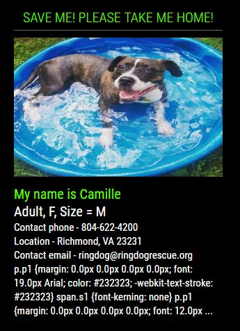
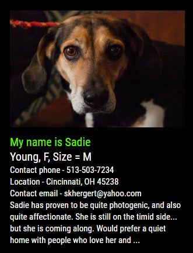
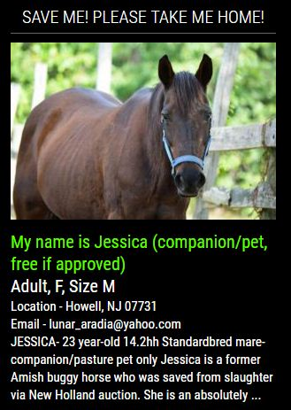
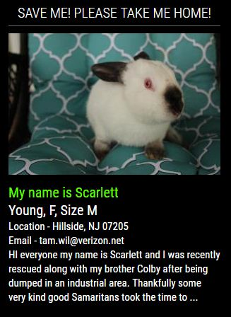

# MMM-PetFinder

* **293,097** Adoptable pets that need a good home.

* **11,460** Shelters and rescue members across **NORTH AMERICA**.

* **All** types of animals for adoption.

* Cat, dog, bird, rabbit, horse, reptile, barnyard, smallfurry .

* I said ALL types.

## Examples

* A rotation of adoptable pets on your mirror, based on the criteria you enter into the config.

* One without a header.

 
 

Fully annotated css file for coloring, sizing, aligning . . .

## Installation of module and dependencies

* `git clone https://github.com/mykle1/MMM-PetFinder.git` into `~/MagicMirror/modules` directory.

* Free API key here - https://www.petfinder.com/user/register

## Add to Config.js

    {
        module: "MMM-PetFinder",
        position: "top_left",
        config: {
			apiKey: "YOUR apiKey",   // <-- Your apiKey goes there!",
			animal: "dog",           // bird, cat, dog, horse, reptile, smallfurry, barnyard
			size: "M",               // S = Small, M = Medium, L = Large, XL = Extra-large
			sex: "F",                // M = Male, F = Female
			location: "10306",       // the ZIP/postal code or city and state (Canada)
			maxWidth: "300px",
			useHeader: false,        // Must be true to use header
			header: "Save me! Please take me home!",
        }
    },

## Rescue a pet! They will be happier and so will you!

## Thanks, yet again, to SpaceCowboysDude for spotting my mistakes
